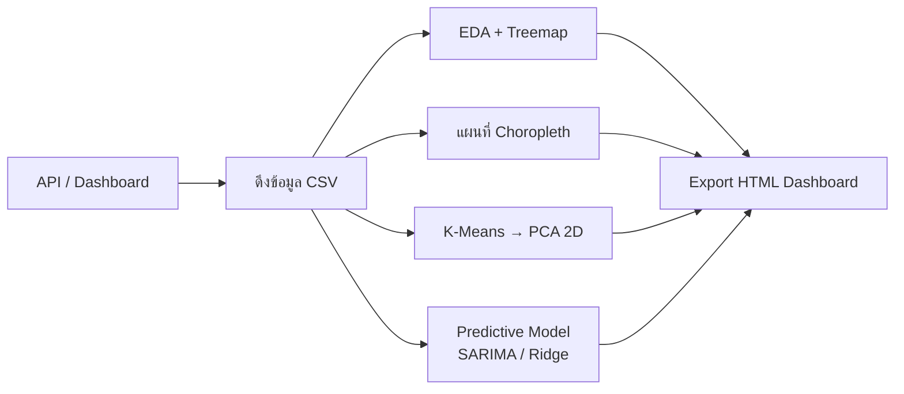

<div align="center">

# 🇹🇭 Thai Government Open Data — Visualization & ML

**วิเคราะห์ข้อมูลเปิดภาครัฐไทย 3 ชุด — เรื่องร้องเรียน/ร้องทุกข์ และราคาค่าก่อสร้าง**
ดึงข้อมูลจริง → EDA → แผนที่ → Clustering → Predictive Model → Interactive Dashboard

<br>


<br>


<sub>เบาะแสยาเสพติดรายจังหวัด (ปปส.) · เรื่องร้องทุกข์ต่อประชากร รายเขต กทม. (สคบ.) · ราคาค่าก่อสร้างรายจังหวัด</sub>

</div>

---

## ✨ ไฮไลต์

- 🔌 **ดึงข้อมูลจาก API รัฐจริง** — ONCB (ป.ป.ส.) แบบ query ตรง + OCPB (สคบ.) จาก Tableau dashboard
- 🗺️ **แผนที่ Choropleth** — ระดับจังหวัด (ทั้งประเทศ) และระดับเขต (กทม. ต่อประชากร)
- 🧩 **Unsupervised** — K-Means + PCA จัดกลุ่มพื้นที่ตามโปรไฟล์
- 🔮 **Predictive** — SARIMA time-series forecast + Ridge regression (แสดง *predicted vs actual*)
- 📊 **Interactive dashboard** — export เป็น HTML ไฟล์เดียว เปิดได้ทันที (มี easter egg 🥚)
- ♻️ **Self-updating** — notebook ปปส. auto-fetch ข้อมูลล่าสุดจาก API เอง

---

## 📦 สามชุดข้อมูล

| | 🔦 [`ปปส/`](ปปส/) | 🛒 [`สคบ/`](สคบ/) | 🏗️ [`สคบ 2/`](สคบ%202/) |
|---|---|---|---|
| **เรื่อง** | เบาะแสยาเสพติด (ONCB) | ร้องทุกข์ผู้บริโภค กทม. (OCPB) | ราคาค่าก่อสร้างอาคาร |
| **ช่วงเวลา** | รายเดือน 2560–2569 | สแนปช็อตปี 2569 | ตารางมาตรฐาน |
| **ขอบเขต** | 77 จังหวัด · 10 ภาค | 50 เขต · 6 กลุ่มเขต | 69 ประเภท × 77 จังหวัด |
| **ปริมาณ** | 8,669 แถว · 194,795 เบาะแส | 50 เขต · 8,461 เรื่อง | 5,313 แถว |
| **โมเดล** | **SARIMA** · MAPE 18.8% | **Ridge** · R² 0.45 | **Ridge** · R² 0.988 |

<div align="center"><sub>แต่ละโฟลเดอร์: <code>*_viz.ipynb</code> · <code>*_viz.html</code> · <code>.csv</code> · <code>.geojson</code> · README</sub></div>

---

## 🔦 ปปส — เบาะแสยาเสพติด (ONCB)

> รายเดือน 114 เดือน · แต่ละจังหวัด/เดือน แยกเป็น **matrix 5 กลุ่มเป้าหมาย × 3 ผลตรวจสอบ**

### 🔮 SARIMA Forecast — Actual vs Predicted

<div align="center">

</div>

พยากรณ์เบาะแสรายเดือน · กันข้อมูล 12 เดือนสุดท้ายไว้ทดสอบ → **MAE 610 · RMSE 691 · MAPE 18.8%**
แล้วพยากรณ์ล่วงหน้า 12 เดือน พร้อมช่วงความเชื่อมั่น 95% — เห็นชัดว่าเบาะแส **พุ่งสูงขึ้นมากในปี 2568–2569** (จาก ~1,500 → ~3,700 เรื่อง/เดือน)

### 🗺️ แผนที่ · Treemap · K-Means

<div align="center">


</div>

**K-Means (k=5 · 12 features):** จัดกลุ่มจังหวัดตามโปรไฟล์การตรวจสอบ — ตั้งแต่กลุ่ม *ปริมาณสูง·พบพฤติการณ์ต่ำ 20%* จนถึงกลุ่ม *พบพฤติการณ์สูง 52%*

<div align="right"><b><a href="ปปส/">อ่านรายละเอียด + API docs →</a></b></div>

---

## 🛒 สคบ — เรื่องร้องทุกข์ผู้บริโภค กทม. (OCPB)

> 50 เขต · จัดกลุ่มเป็น **6 กลุ่มเขต** ตามการแบ่งของ กทม. · มีข้อมูลประชากรจาก geojson สำมะโน

### 🔮 Ridge Regression — Predicted vs Actual

<div align="center">

</div>

ทำนายจำนวนเรื่องร้องทุกข์รายเขต จาก **ประชากร + สัดส่วนประเภท + กลุ่มเขต** (5-fold CV) → **R² 0.45 · MAE 42**
ประชากรเป็นตัวขับหลัก (corr ≈ 0.68) · จตุจักรเป็น outlier ชัดเจน

### 🗺️ แผนที่ · Treemap · K-Means · สถานะ

<div align="center">


</div>

**K-Means (k=4 · 7 features):** จัดกลุ่ม 50 เขตตามโปรไฟล์ประเภทเรื่องร้องทุกข์ + ปริมาณ + ความกระจุกตัว

<div align="right"><b><a href="สคบ/">อ่านรายละเอียด + API docs →</a></b></div>

---

## 🏗️ สคบ 2 — ราคาค่าก่อสร้างอาคาร

> ราคาค่าก่อสร้างมาตรฐาน (บาท/ตร.ม.) · **69 ประเภทอาคาร × 77 จังหวัด = 5,313 แถว** (matrix ครบ)

### 🔮 Ridge Regression — Predicted vs Actual

<div align="center">

</div>

ประเมินราคาค่าก่อสร้างจาก **ประเภทอาคาร (69) + ภูมิภาค (6)** (5-fold CV) → **R² 0.988 · MAE 227 ฿/ตร.ม.**
ประเภทอาคารกำหนดราคาหลัก · ภูมิภาคปรับตามต้นทุนพื้นที่

### 🗺️ แผนที่ · Treemap · K-Means

<div align="center">


</div>

**K-Means (k=4 · 7 features):** จัดกลุ่มจังหวัดตามโครงสร้างราคา (PC1 = ระดับราคารวม 82%) — แม่ฮ่องสอน/ภาคใต้แพงสุด (ค่าขนส่ง), ที่ราบภาคกลาง/อีสานถูกสุด

<div align="right"><b><a href="สคบ%202/">อ่านรายละเอียด →</a></b></div>

---

## 🔁 Pipeline (เหมือนกันทั้ง 3 ชุด)



---

## ▶️ วิธีใช้งาน

```bash
pip install pandas plotly scikit-learn statsmodels

# เปิด notebook แล้ว Run all — ได้ dashboard HTML
jupyter notebook ปปส/pps_viz.ipynb          # หรือ  สคบ/ocpb_viz.ipynb  ·  สคบ 2/construct_viz.ipynb
```

- 🟢 **Google Colab:** เปิดแล้ว *Run all* ได้เลย — เซลล์แรกติดตั้ง dependency · ปปส. **auto-fetch จาก API** และ สคบ. **ฝังข้อมูลไว้ในตัว** (ไม่ต้องอัปโหลดไฟล์)
- 🌐 **ดู dashboard ทันที:** เปิด [`ปปส/pps_viz.html`](ปปส/pps_viz.html) · [`สคบ/ocpb_viz.html`](สคบ/ocpb_viz.html) · [`สคบ 2/construct_viz.html`](สคบ%202/construct_viz.html) ในเบราว์เซอร์ (ลองกดปุ่มลอย 🚨 / 🛒 / 🏗️ มุมขวาล่าง 👀)

---

## 📁 โครงสร้างโปรเจกต์

```
thai-gov-complaint-viz/
├── README.md
├── assets/                     # 19 รูปผลลัพธ์ (แผนที่ · โมเดล · cluster)
├── ปปส/                        # ONCB — เบาะแสยาเสพติด
│   ├── pps_viz.ipynb           # notebook 22 เซลล์ (self-updating)
│   ├── pps_viz.html            # interactive dashboard
│   ├── oncb_verify_monthly.csv # ข้อมูลรายเดือน 2560–2569
│   ├── oncb_complaint_04.csv   # ข้อมูลรายปี (map ภาค)
│   ├── th_provinces.geojson    # ขอบเขต 77 จังหวัด
│   └── README.md               # + API documentation
├── สคบ/                        # OCPB — เรื่องร้องทุกข์ผู้บริโภค
│   ├── ocpb_viz.ipynb          # notebook 22 เซลล์ (self-contained)
│   ├── ocpb_viz.html           # interactive dashboard
│   ├── ocpb_complaint_bkk.csv  # 50 เขต
│   ├── bkk_districts.geojson   # ขอบเขตเขต + ประชากร
│   └── README.md               # + API documentation
└── สคบ 2/                      # ราคาค่าก่อสร้างอาคาร
    ├── construct_viz.ipynb     # notebook 22 เซลล์
    ├── construct_viz.html      # interactive dashboard
    ├── construct_all_20240805.csv  # 69 ประเภท × 77 จังหวัด
    ├── th_provinces.geojson    # ขอบเขต 77 จังหวัด
    └── README.md
```

---

## 🧰 Tech stack

| หมวด | เครื่องมือ |
|------|-----------|
| Data | **pandas** · REST API (urllib) |
| Viz | **Plotly** — treemap · choropleth · scatter · time series · donut |
| Unsupervised | **scikit-learn** — StandardScaler → KMeans → PCA |
| Predictive | **statsmodels** SARIMA · **scikit-learn** Ridge |
| Maps | GeoJSON choropleth (province & Bangkok-district boundaries) |

---

## 📚 แหล่งข้อมูล

| ชุด | Data catalog | API / ที่มา |
|-----|-------------|-----|
| ปปส | [gdpublish-complain-04](https://gdcatalog.go.th/dataset/gdpublish-complain-04) | [data.oncb.go.th](https://data.oncb.go.th/complain_021) |
| สคบ | [gdpublish-opendata-03](https://gdcatalog.go.th/dataset/gdpublish-opendata-03) | [OCPB Connect](https://ocpbconnect.ocpb.go.th/Report/Detail?report_id=7EF99779-95B5-4541-A374-378B1CD11140) |
| สคบ 2 | ตารางราคามาตรฐานค่าก่อสร้าง | `construct_all_20240805.csv` (ไม่มี public API) |

**ขอบเขตแผนที่:** [chingchai/OpenGISData-Thailand](https://github.com/chingchai/OpenGISData-Thailand) (จังหวัด) · [pcrete/gsvloader-demo](https://github.com/pcrete/gsvloader-demo) (เขต กทม.)

<div align="center">
<br>
<sub>⚠️ ข้อมูลเป็นสถิติสรุประดับพื้นที่จากข้อมูลเปิดภาครัฐ · ใช้เพื่อการศึกษา/วิเคราะห์เท่านั้น</sub>
</div>
