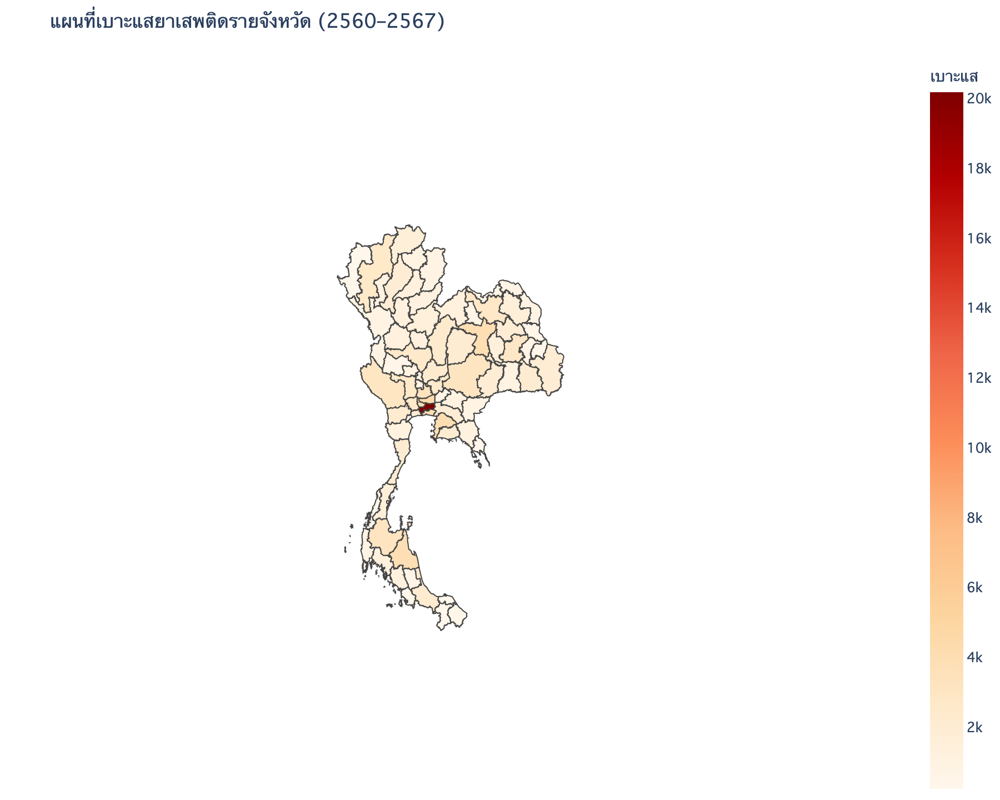
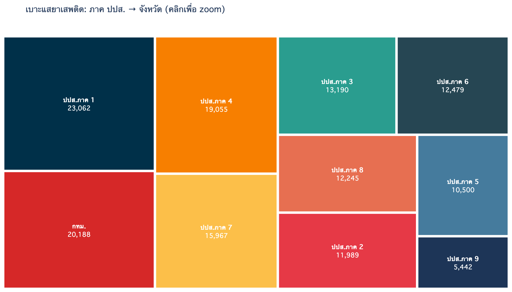
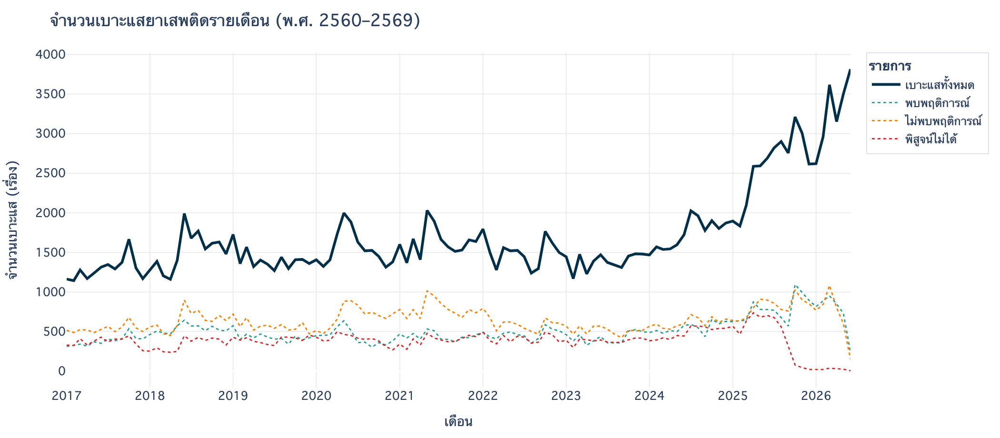
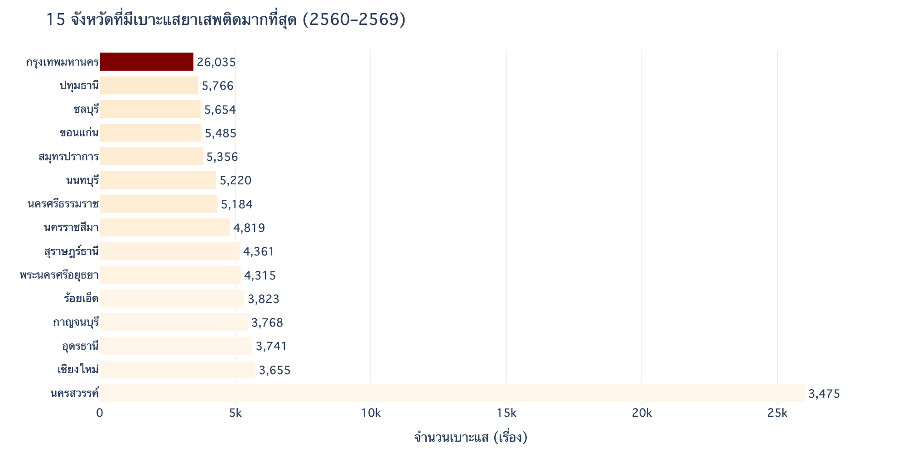
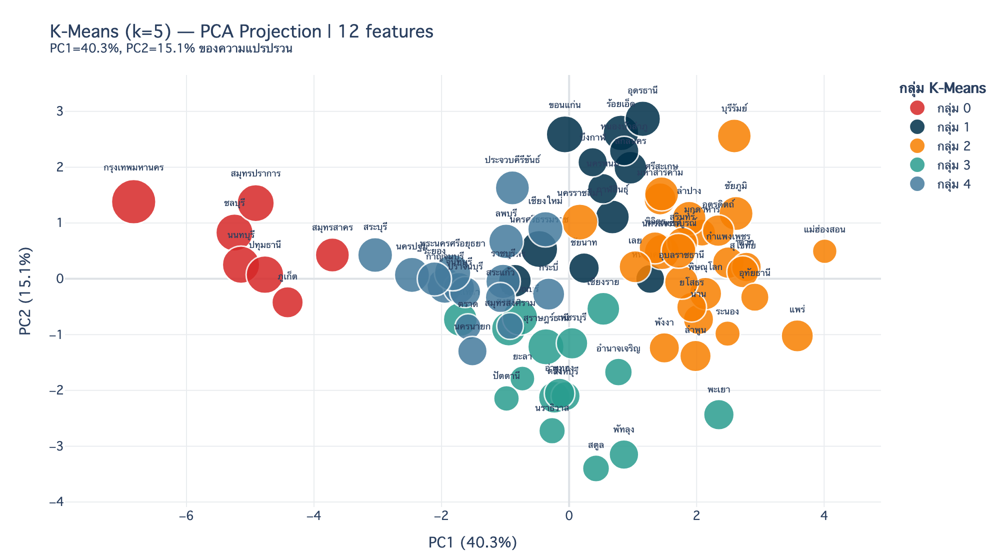
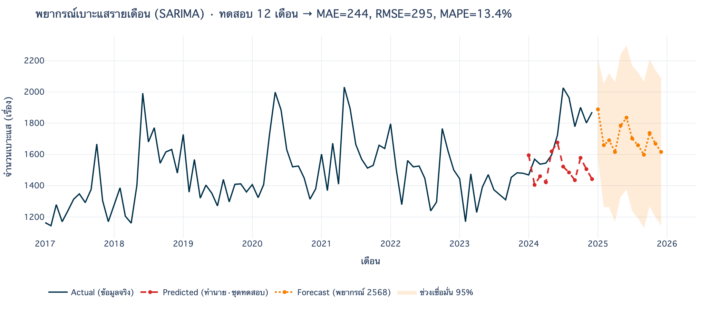

# 🔦 ปปส — เบาะแส/ร้องเรียนยาเสพติด (ONCB)

> การตรวจสอบ**เบาะแส/ร้องเรียนยาเสพติด**รายเดือน แยกตามจังหวัด · สำนักงาน ป.ป.ส. (ONCB)

| ช่วงเวลา | ขอบเขต | ปริมาณ | ตรวจพบพฤติการณ์ | โมเดล |
|---|---|---|---|---|
| 2560–2569 (114 เดือน) | 77 จังหวัด · 10 ภาค | 8,669 แถว · 194,795 เบาะแส | 33% | SARIMA · MAPE 18.8% |

---

## 🔎 ข้อค้นพบสำคัญ

- 📈 **เบาะแสพุ่งขึ้น ~2.5 เท่า** — เฉลี่ยจาก **1,288 → 3,278 เรื่อง/เดือน** (2560 → 2569) เร่งตัวแรงในปี 2568–2569
- 🏙️ **กระจุกที่เมืองใหญ่** — กรุงเทพฯ 26,035 · ปทุมธานี 5,766 · ชลบุรี 5,654 · ขอนแก่น 5,485 · สมุทรปราการ 5,356
- 🔍 **ตรวจแล้วพบพฤติการณ์ 33%** ของเบาะแสที่ตรวจสอบทั้งหมด
- 🧩 **K-Means แยก 5 กลุ่ม** — ตั้งแต่กลุ่ม *ปริมาณสูง·พบพฤติการณ์ต่ำ 20%* ถึงกลุ่ม *พบพฤติการณ์สูง 52%*

---

## 📊 ผลการวิเคราะห์

**🗺️ แผนที่ & โครงสร้างพื้นที่**

| แผนที่เบาะแสรายจังหวัด | Treemap: ภาค → จังหวัด |
|:---:|:---:|
|  |  |

**📈 แนวโน้มรายเดือน & อันดับจังหวัด**

| Time series + ผลตรวจสอบ 3 แบบ | Top 15 จังหวัด |
|:---:|:---:|
|  |  |

**🧩 K-Means Clustering** — จัดกลุ่มจังหวัดตามโปรไฟล์การตรวจสอบ (12 features → PCA 2 มิติ)

<p align="center"></p>

**🔮 SARIMA Forecast** — พยากรณ์รายเดือน · แสดง *actual vs predicted* + ล่วงหน้า 12 เดือน

<p align="center"></p>

---

## 🔮 โมเดล & ฟีเจอร์

- **SARIMA(1,1,1)(1,1,1)₁₂** — กันข้อมูล 12 เดือนสุดท้ายไว้ทดสอบ → **MAE 610 · RMSE 691 · MAPE 18.8%** แล้ว refit ทั้งหมดเพื่อพยากรณ์ล่วงหน้า 12 เดือน (ช่วงเชื่อมั่น 95%)
- **K-Means (k=5) — 12 features:** สัดส่วนกลุ่มเป้าหมาย 5 + สัดส่วนผลตรวจสอบ 3 + found_rate + verify_rate + log_volume + trend

---

## 🔌 ข้อมูล & การดึงข้อมูล

ดึงจาก **ONCB API สาธารณะ** (ไม่ต้อง auth) · catalog: [gdpublish-complain-04](https://gdcatalog.go.th/dataset/gdpublish-complain-04) · portal: [data.oncb.go.th](https://data.oncb.go.th/complain_021)

```
GET https://dataapi.oncb.go.th/suppress/complainVerify/{เดือน 01-12}/{ปีพ.ศ.}   # รายเดือน (ข้อมูลหลัก)
GET https://dataapi.oncb.go.th/suppress/complain/{ปี 2558-2566}                  # รายปี (map ภาค ปปส.)
```

โครงสร้างเป็น **matrix 5 กลุ่มเป้าหมาย × 3 ผลตรวจสอบ** ต่อจังหวัดต่อเดือน

<details><summary><b>📋 Data dictionary + โค้ดดึงข้อมูล (คลิก)</b></summary>

| Field | คำอธิบาย |
|-------|----------|
| `PROV_ID` / `PROV_NAME` | รหัส / ชื่อจังหวัด |
| `NEWS_MONTH_CODE` / `NEWS_YEAR` | เดือน / ปี พ.ศ. |
| `COMPLAIN_ALL` | ร้องเรียนทั้งหมด (เรื่อง) |
| `ALL1` / `ALL2` / `ALL3` / `ALL123` | ผลตรวจสอบ: พบพฤติการณ์ / ไม่พบ / พิสูจน์ไม่ได้ / รวม |
| `FOUNDS` (+`F1`–`F123`) | **กลุ่ม 1:** มีตัวตน · พบพฤติการณ์ |
| `NOTFOUNDS` (+`NF*`) | **กลุ่ม 2:** มีตัวตน · ไม่พบพฤติการณ์ |
| `UNKNOW` (+`U*`) | **กลุ่ม 3:** ไม่มีตัวตนใน ทร.14 |
| `PLACE` (+`P*`) | **กลุ่ม 4:** กลุ่มสถานที่ |
| `AREA` (+`A*`) | **กลุ่ม 5:** กลุ่มพื้นที่ |

> `COMPLAIN_ALL` = `FOUNDS + NOTFOUNDS + UNKNOW + PLACE + AREA` ≈ `ALL1 + ALL2 + ALL3`

```python
import urllib.request, json
rows = []
for year in range(2560, 2570):          # 2569 มีถึงเดือน 06 (มิ.ย. 2026)
    for m in range(1, 13):
        url = f"https://dataapi.oncb.go.th/suppress/complainVerify/{m:02d}/{year}"
        with urllib.request.urlopen(url, timeout=30) as r:
            rows += json.load(r).get("data", [])
```

</details>

> ♻️ **Self-updating:** เซลล์โหลดข้อมูลจะ auto-fetch จาก API ถ้าไม่พบ CSV (ดึงถึงปีปัจจุบัน) · หัวข้อกราฟคำนวณช่วงปีจากข้อมูลจริง — เปิดใน Colab แล้ว *Run all* ได้เลย

---

## 📁 ไฟล์

```
ปปส/
├── code/   pps_viz.ipynb · pps_viz.html      ← notebook (22 เซลล์) + dashboard
└── data/   oncb_verify_monthly.csv (รายเดือน 8,669 แถว 2560–2569)
            oncb_complaint_04.csv (รายปี · map ภาค) · th_provinces.geojson (77 จังหวัด)
```

> notebook อ่านข้อมูลจาก `../data/` อัตโนมัติ (ถ้าไม่พบจะ auto-fetch จาก API) — เปิดใน Colab ก็รันได้
