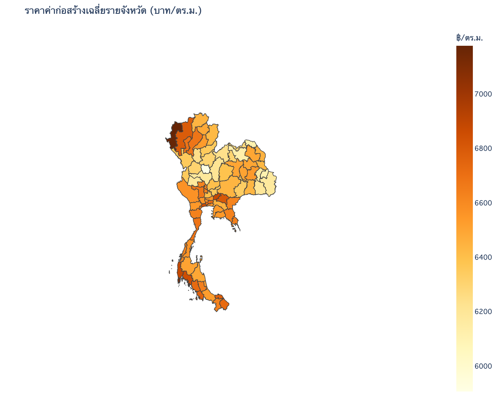
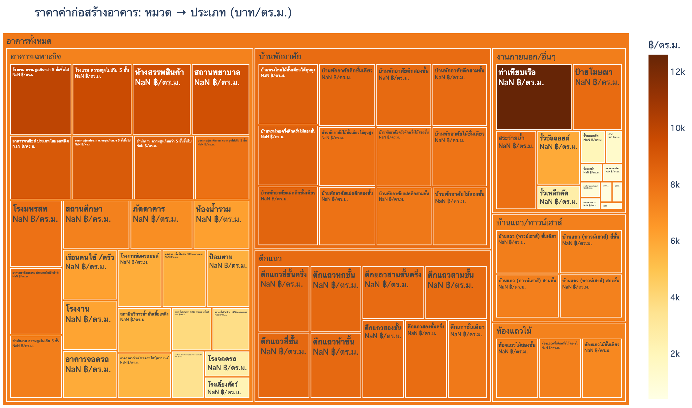
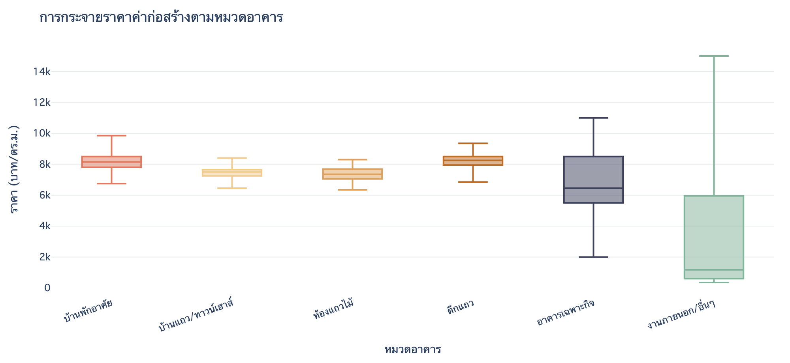
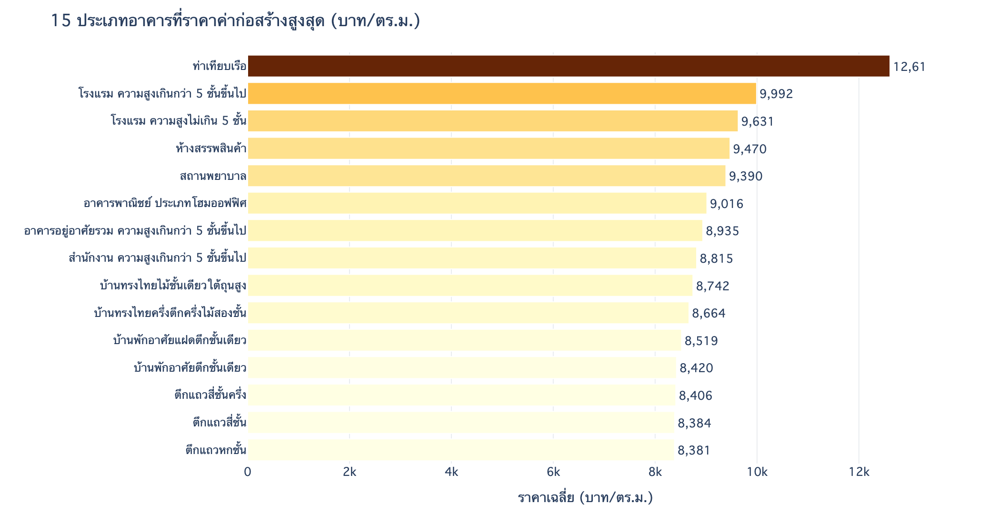
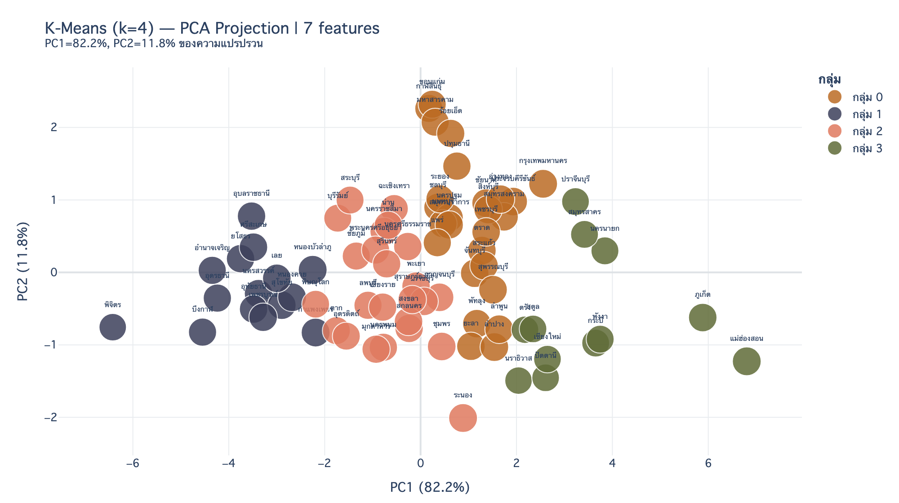
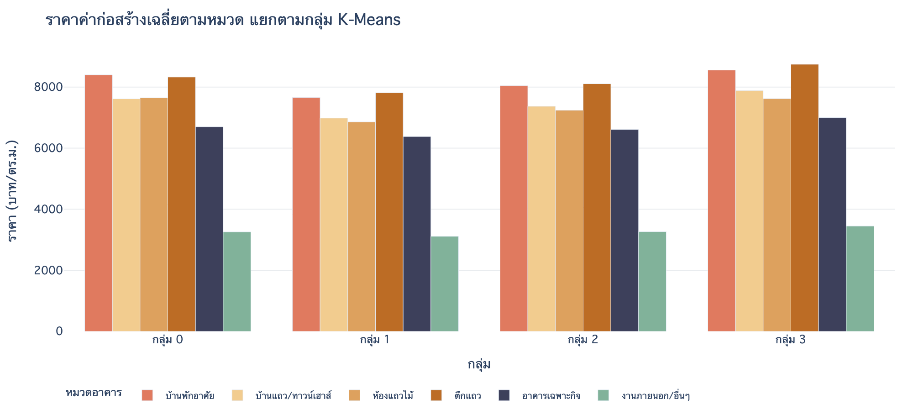
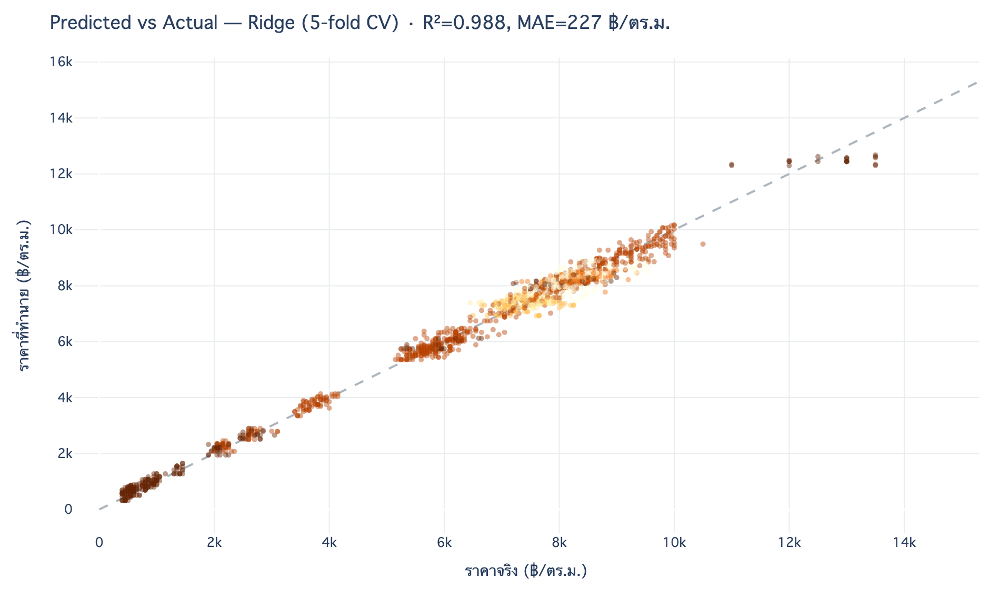

# 🏗️ ราคามาตรฐานค่าก่อสร้างอาคาร รายจังหวัด

> ราคา**ค่าก่อสร้างต่อตารางเมตร (บาท/ตร.ม.)** ของอาคาร 69 ประเภท ครบทั้ง 77 จังหวัด · ใช้เป็นฐานประเมินราคา/ภาษี

| มิติ | ราคาเฉลี่ย | ช่วงราคา | โมเดล |
|---|---|---|---|
| 69 ประเภท × 77 จังหวัด = 5,313 แถว | 6,513 ฿/ตร.ม. | 350 (รั้วลวดหนาม) – 15,000 (ท่าเทียบเรือ) | Ridge · R² 0.988 |

---

## 🔎 ข้อค้นพบสำคัญ

- 🏗️ **หมวดที่แพงสุด** — ตึกแถว 8,224 · บ้านพักอาศัย 8,169 ฿/ตร.ม. · **ถูกสุด** งานภายนอก 3,263 (รั้ว/ถนน/สระ)
- 🥇 **ประเภทแพงสุด** ท่าเทียบเรือ 12,610 · **ถูกสุด** รั้วลวดหนาม 412 ฿/ตร.ม. (ต่างกัน ~30 เท่า)
- 🗺️ **จังหวัดแพงสุด** แม่ฮ่องสอน 7,178 · ภูเก็ต 7,067 · พังงา 6,883 — พื้นที่ห่างไกล/เกาะ ค่าขนส่งสูง
- 🏞️ **ถูกสุด** พิจิตร 5,907 · บึงกาฬ · อำนาจเจริญ — ที่ราบภาคกลาง/อีสาน
- 🧩 **K-Means 4 กลุ่มตามระดับราคา** — PC1 อธิบายความแปรปรวน **82%** (จังหวัดที่แพงมักแพงทุกประเภทอาคาร)

---

## 📊 ผลการวิเคราะห์

**🗺️ แผนที่ & โครงสร้างราคา**

| แผนที่: ราคาเฉลี่ยรายจังหวัด | Treemap: หมวด → ประเภท (ตามราคา) |
|:---:|:---:|
|  |  |

**📈 การกระจายราคา & อันดับ**

| Box plot: ราคาตาม 6 หมวด | Top 15 อาคารแพงสุด |
|:---:|:---:|
|  |  |

**🧩 K-Means Clustering** — จัดกลุ่มจังหวัดตามโครงสร้างราคา (7 features → PCA 2 มิติ)

| PCA scatter (4 กลุ่มราคา) | ราคาแต่ละหมวดของแต่ละกลุ่ม |
|:---:|:---:|
|  |  |

**🔮 Ridge Regression** — ประเมินราคาค่าก่อสร้าง · แสดง *predicted vs actual*

---

## 🔮 โมเดล

**Ridge Regression** — ทำนายราคา (บาท/ตร.ม.) จาก **ประเภทอาคาร (69) + ภูมิภาค (6)** (5-fold CV) → **R² 0.988 · MAE 227 ฿/ตร.ม.**
ประเภทอาคารกำหนดราคาหลัก · ภูมิภาคปรับตามต้นทุนพื้นที่ (แม่ฮ่องสอน/ภาคใต้แพงกว่าเพราะค่าขนส่ง)

---

## 🗂️ โครงสร้างข้อมูล

| คอลัมน์ | คำอธิบาย |
|---------|----------|
| `ID_CONSTR` / `NAME_CONSTR` | รหัส / ชื่อประเภทอาคาร (เช่น `105` บ้านพักอาศัยตึกสองชั้น) |
| `CHANGWAT_CODE` / `CHANGWAT_NAME` | รหัส / ชื่อจังหวัด |
| `PRICE_CONSTR` | ราคาค่าก่อสร้าง (บาท/ตารางเมตร) |

**6 หมวด** (หลักแรกของ `ID_CONSTR`): `1xx` บ้านพักอาศัย · `2xx` บ้านแถว/ทาวน์เฮาส์ · `3xx` ห้องแถวไม้ · `4xx` ตึกแถว · `5xx` อาคารเฉพาะกิจ · `6xx` งานภายนอก

> ℹ️ เป็นตารางราคามาตรฐาน (ไม่มี public API) — notebook อ่านจาก `construct_all_20240805.csv` โดยตรง · แผนที่โหลด geojson จากไฟล์/URL อัตโนมัติ

---

## 📁 ไฟล์

| ไฟล์ | รายละเอียด |
|------|-----------|
| `construct_viz.ipynb` · `construct_viz.html` | notebook (22 เซลล์) + dashboard |
| `construct_all_20240805.csv` | ราคา 5,313 แถว (69 ประเภท × 77 จังหวัด) |
| `th_provinces.geojson` | ขอบเขต 77 จังหวัด |
