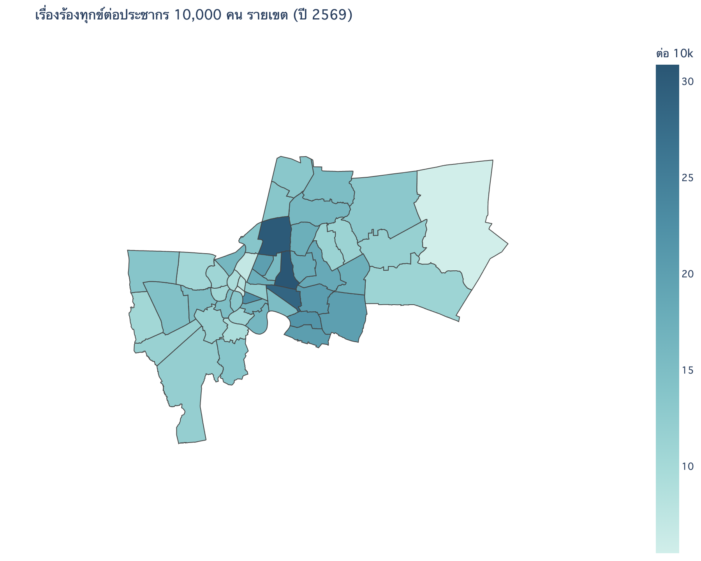
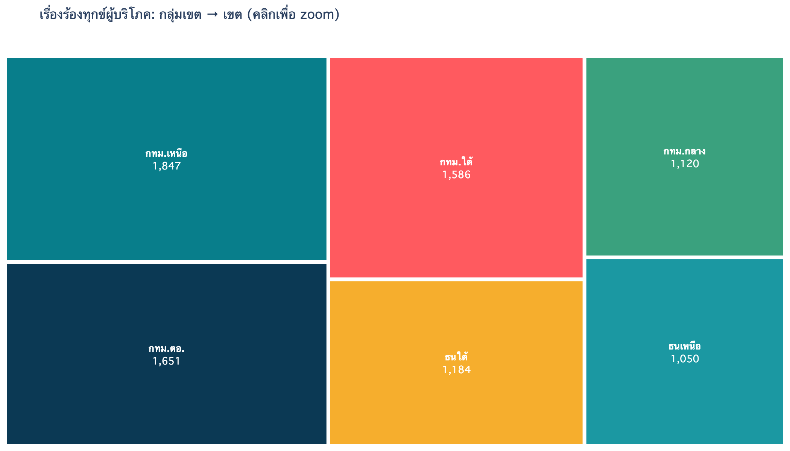
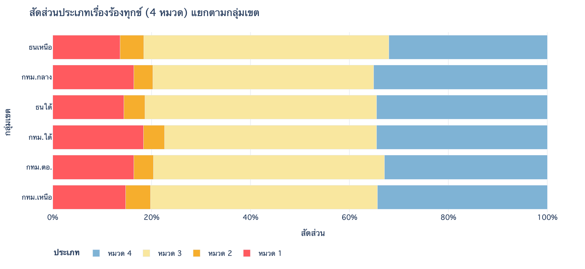
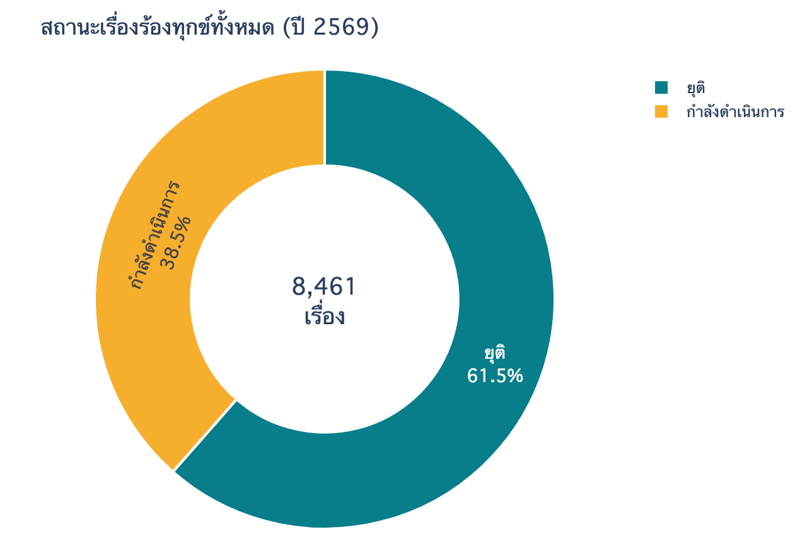
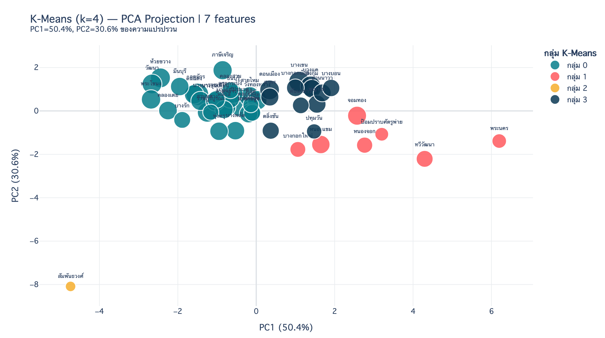
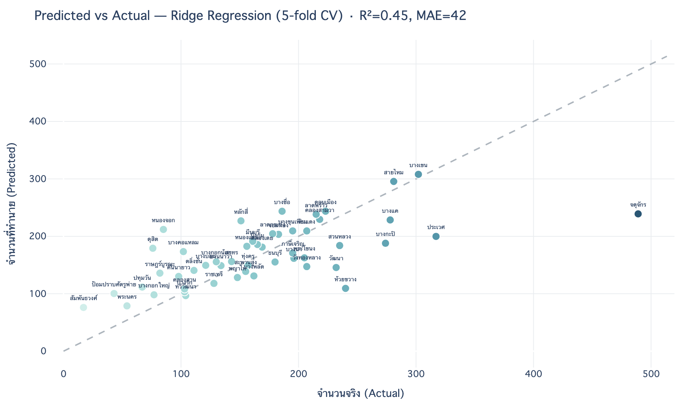

# 🛒 สคบ — เรื่องร้องทุกข์ผู้บริโภค กทม. (OCPB)

> สถิติ**เรื่องร้องทุกข์ผู้บริโภค**ในเขตกรุงเทพมหานคร · สำนักงานคณะกรรมการคุ้มครองผู้บริโภค (OCPB)

| ช่วงเวลา | ขอบเขต | ปริมาณ | สถานะ | โมเดล |
|---|---|---|---|---|
| สแนปช็อตปี 2569 | 50 เขต · 6 กลุ่มเขต | 8,461 เรื่อง | ยุติ 61% · ดำเนินการ 39% | Ridge · R² 0.45 |

---

## 🔎 ข้อค้นพบสำคัญ

- 🏙️ **เขตที่ร้องทุกข์มากสุด** — จตุจักร 489 · ประเวศ 317 · บางเขน 302 · สายไหม 281 · บางแค 278
- 👥 **ต่อประชากรสูงสุด** — ห้วยขวาง 30.9 · จตุจักร 30.3 · วัฒนา 28.7 เรื่อง/หมื่นคน (ย่านธุรกิจหนาแน่น)
- 🧭 **กลุ่มเขตเหนือมากสุด** — กรุงเทพเหนือ 1,847 เรื่อง · น้อยสุด ธนบุรีเหนือ 1,050
- ✅ **ยุติเรื่องแล้ว 61%** (5,200) · กำลังดำเนินการ 39% (3,261)

---

## 📊 ผลการวิเคราะห์

**🗺️ แผนที่ & โครงสร้างพื้นที่**

| แผนที่: เรื่องร้องทุกข์ต่อประชากรหมื่นคน | Treemap: กลุ่มเขต → เขต |
|:---:|:---:|
|  |  |

**📈 องค์ประกอบประเภท & สถานะเรื่อง**

| สัดส่วน 4 หมวด แยกตามกลุ่มเขต | สถานะเรื่อง (ยุติ / ดำเนินการ) |
|:---:|:---:|
|  |  |

**🧩 K-Means Clustering** — จัดกลุ่ม 50 เขตตามโปรไฟล์เรื่องร้องทุกข์ (7 features → PCA 2 มิติ)

<p align="center"></p>

**🔮 Ridge Regression** — ทำนายจำนวนเรื่องร้องทุกข์รายเขต · แสดง *predicted vs actual*

<p align="center"></p>

---

## 🔮 โมเดล & ฟีเจอร์

- **Ridge Regression** — ทำนายจำนวนเรื่องจาก **ประชากร + สัดส่วนประเภท 4 หมวด + กลุ่มเขต** (5-fold CV) → **R² 0.45 · MAE 42**
  ประชากรเป็น feature หลัก (corr ≈ 0.68) · จตุจักรเป็น outlier ชัดเจน · ส่วนที่เหลือ = ปัจจัยเศรษฐกิจ/พาณิชย์ที่ไม่มีในข้อมูล
- **K-Means (k=4) — 7 features:** สัดส่วนประเภท 4 + log_volume + top_share (ความกระจุกตัว) + entropy (ความหลากหลาย)
- **6 กลุ่มเขต (กทม.):** กรุงเทพกลาง · กรุงเทพใต้ · กรุงเทพเหนือ · กรุงเทพตะวันออก · ธนบุรีเหนือ · ธนบุรีใต้

---

## 🔌 ข้อมูล & การเข้าถึง

catalog: [gdpublish-opendata-03](https://gdcatalog.go.th/dataset/gdpublish-opendata-03) · [OCPB Connect dashboard](https://ocpbconnect.ocpb.go.th/Report/Detail?report_id=7EF99779-95B5-4541-A374-378B1CD11140)

> ⚠️ **Web Service ทางการ (`ComplaintBangkok`) ต้องใช้ `apiKey` + `password`** ที่ไม่เผยแพร่สาธารณะ — โปรเจกต์นี้จึงดึงจาก **public Tableau dashboard** แทน ทำให้ได้เฉพาะ **สแนปช็อตปี 2569** · ไม่มีข้อมูลย้อนหลัง (ไม่มี time series) · หมวดประเภทแสดงเป็น *หมวด 1–4* (dashboard ไม่เปิดชื่อ)

<details><summary><b>📋 Official Web Service API + Response schema (คลิก)</b></summary>

```
GET https://ocpbconnect.ocpb.go.th/api/Complaint/ComplaintBangkok
Headers : apiKey (required) · password (required)
Params  : yearStart (int) · yearEnd (int)
```

| Field | คำอธิบาย |
|-------|----------|
| `complaintTotal` / `complaintInprogressTotal` / `complaintTerminateTotal` | จำนวนทั้งหมด / กำลังดำเนินการ / ยุติ |
| `complaintTumbon[]` | array แยกตาม ปี · ประเภท · สถานะ · เขต (`ampher`) · แขวง (`tumbon`) |

[คู่มือ API (PDF)](https://ocpb.gdcatalog.go.th/dataset/10b080fa-7f7e-43b3-8f17-32a8edacd88f/resource/b5ff7dde-d734-4c1f-9584-0a06b57755f6/download/untitled.pdf) · หากมี credential จะขยายเป็น time series ย้อนหลัง + ชื่อประเภทจริง + ระดับแขวงได้

</details>

> ♻️ **Self-contained:** notebook ฝังสแนปช็อต 50 เขตไว้ในตัว + สร้าง CSV ให้ถ้าไม่พบ · geojson โหลดจาก URL เอง — เปิดใน Colab แล้ว *Run all* ได้เลย

---

## 📁 ไฟล์

```
สคบ/
├── code/   ocpb_viz.ipynb · ocpb_viz.html    ← notebook (22 เซลล์) + dashboard
└── data/   ocpb_complaint_bkk.csv (50 เขต · 4 หมวด · กลุ่มเขต · ยอดรวม)
            bkk_districts.geojson (ขอบเขตเขต กทม. + ประชากร)
```

> notebook อ่านข้อมูลจาก `../data/` อัตโนมัติ (ถ้าไม่พบจะสร้างจากสแนปช็อตที่ฝังไว้) — เปิดใน Colab ก็รันได้
